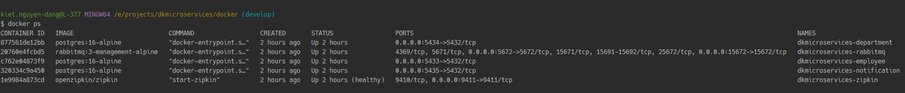
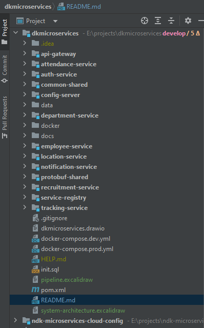
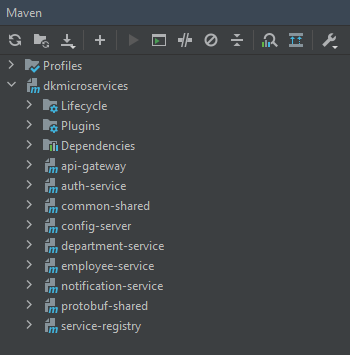
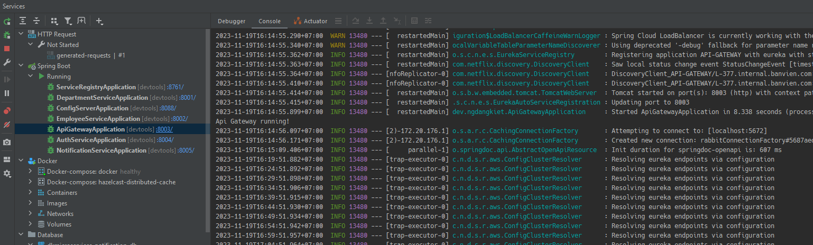
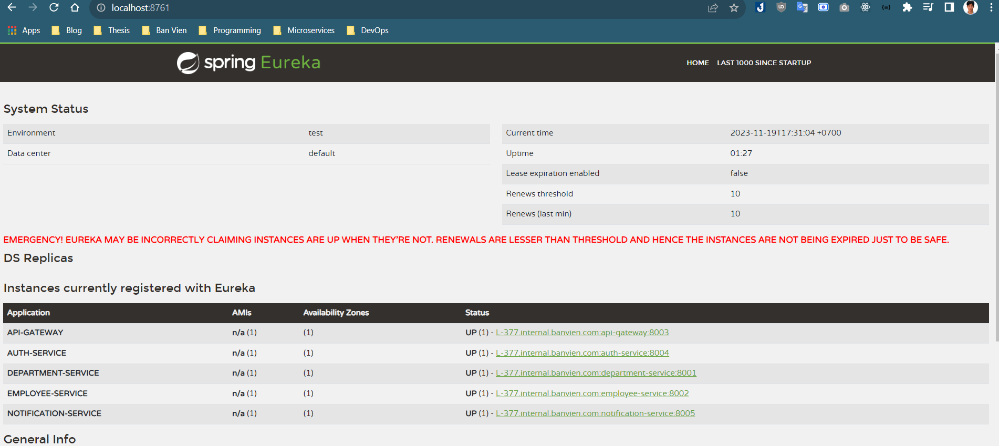
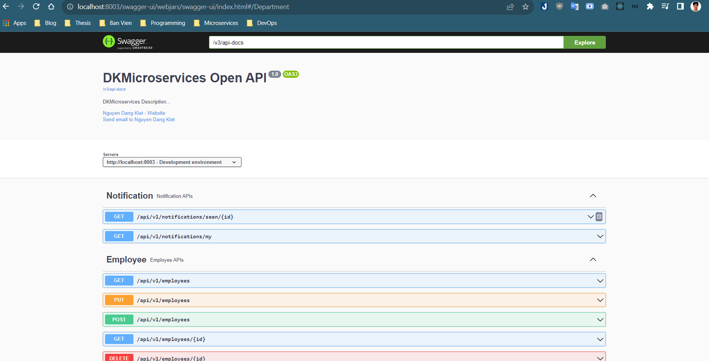
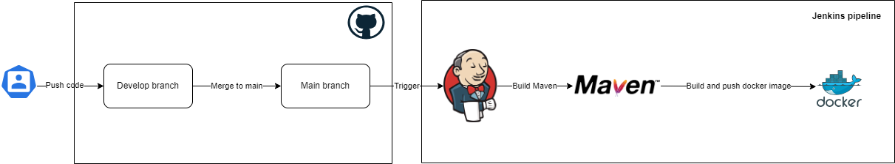
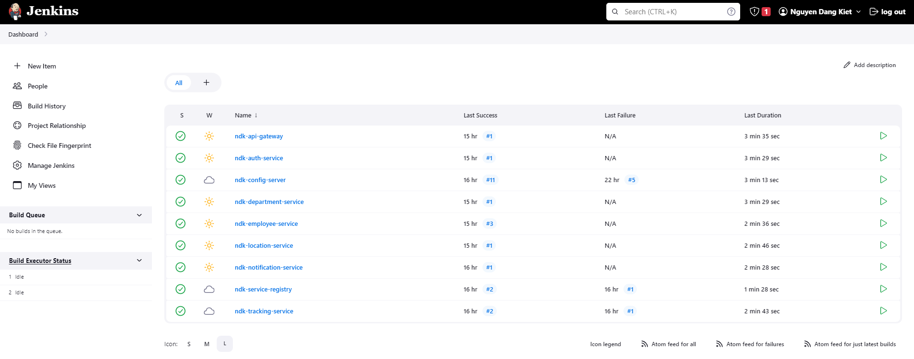
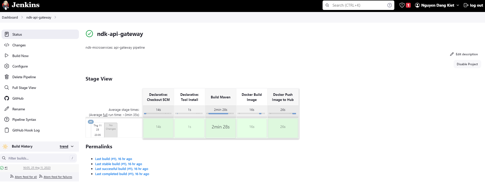
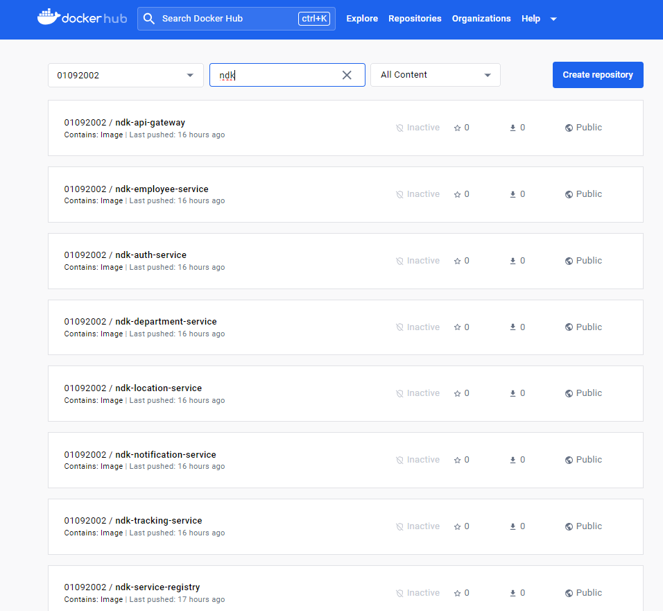

# DKMicroservices

Simple Microservices with Spring Boot and gRPC

## Prerequisites

- [Docker](https://docs.docker.com/engine/install/)
- [Docker Compose](https://docs.docker.com/compose/install/)
- [JDK 17](https://www.oracle.com/java/technologies/javase/jdk17-archive-downloads.html)

## Installing required tools

- Once the prerequisites are installed, run the command in folder ***/docker***.

```
docker-compose up -d
```

- Docker Containers

  

## Project Structure and Technical Stack

- Project Structure

  
- Technical Stack

<table>
    <tr>
        <td></td>
        <td>Spring Cloud</td>
        <td>Spring Security</td>
        <td>Rest Server</td>
        <td>gRPC Server</td>
        <td>Postgresql</td>
        <td>RabbitMQ</td>
        <td>ElasticSearch</td>
        <td>Redis</td>
    </tr>
    <tr>
        <td>Config Server</td>
        <td>x</td>
        <td></td>
        <td></td>
        <td></td>
        <td></td>
        <td></td>
        <td></td>
        <td></td>
    </tr>
    <tr>
        <td>Service Registry</td>
        <td>x</td>
        <td></td>
        <td>x</td>
        <td></td>
        <td></td>
        <td></td>
        <td></td>
        <td></td>
    </tr>
    <tr>
        <td>Api Gateway</td>
        <td>x</td>
        <td>x</td>
        <td>x</td>
        <td></td>
        <td></td>
        <td>x</td>
        <td></td>
        <td>x</td>
    </tr>
    <tr>
        <td>Auth Service</td>
        <td>x</td>
        <td>x</td>
        <td></td>
        <td>x</td>
        <td></td>
        <td></td>
        <td></td>
        <td></td>
    </tr>
    <tr>
        <td>Employee Service</td>
        <td>x</td>
        <td></td>
        <td></td>
        <td>x</td>
        <td>x</td>
        <td>x</td>
        <td></td>
        <td></td>
    </tr>
    <tr>
        <td>Department Service</td>
        <td>x</td>
        <td></td>
        <td></td>
        <td>x</td>
        <td>x</td>
        <td></td>
        <td></td>
        <td></td>
    </tr>
    <tr>
        <td>Notification Service</td>
        <td>x</td>
        <td></td>
        <td></td>
        <td>x</td>
        <td>x</td>
        <td>x</td>
        <td></td>
        <td></td>
    </tr>
    <tr>
        <td>Location Service</td>
        <td>x</td>
        <td></td>
        <td></td>
        <td>x</td>
        <td></td>
        <td></td>
        <td></td>
        <td></td>
    </tr>
    <tr>
        <td>Tracking Service</td>
        <td>x</td>
        <td></td>
        <td></td>
        <td>x</td>
        <td></td>
        <td>x</td>
        <td>x</td>
        <td></td>
    </tr>
</table>

- Services Port

<table>
  <tr>
      <td></td>
      <td>Rest Server Port</td>
      <td>gRPC Server Port</td>
  </tr>
  <tr>
      <td>Config Server</td>
      <td>8088</td>
      <td></td>
  </tr>
  <tr>
      <td>Service Registry</td>
      <td>8761</td>
      <td></td>
  </tr>
  <tr>
      <td>Api Gateway</td>
      <td>8003</td>
      <td></td>
  </tr>
  <tr>
      <td>Auth Service</td>
      <td>8004</td>
      <td>8040</td>
  </tr>
  <tr>
      <td>Employee Service</td>
      <td>8002</td>
      <td>8020</td>
  </tr>
  <tr>
      <td>Department Service</td>
      <td>8001</td>
      <td>8010</td>
  </tr>
  <tr>
      <td>Notification Service</td>
      <td>8005</td>
      <td>8050</td>
  </tr>
  <tr>
      <td>Location Service</td>
      <td>8006</td>
      <td>8060</td>
  </tr>
  <tr>
      <td>Tracking Service</td>
      <td>8007</td>
      <td>8070</td>
  </tr>
</table>

## Run on Local

- Run with IntelliJ IDEA

- Run command in root project ***/dkmicroservices***

```
mvn clean install
```

- Maven

  

- Service run order: service-registry, config-server > department-service, employee-service, auth-service,
  notification-service > api-gateway

  

- Open browser and type _http://localhost:8761_. All services already started

  

- Type _http://localhost:8003/swagger-ui/index.html_

  

## CI/CD

- Pipeline

  

- Jenkins

  

  

- Docker Hub

  